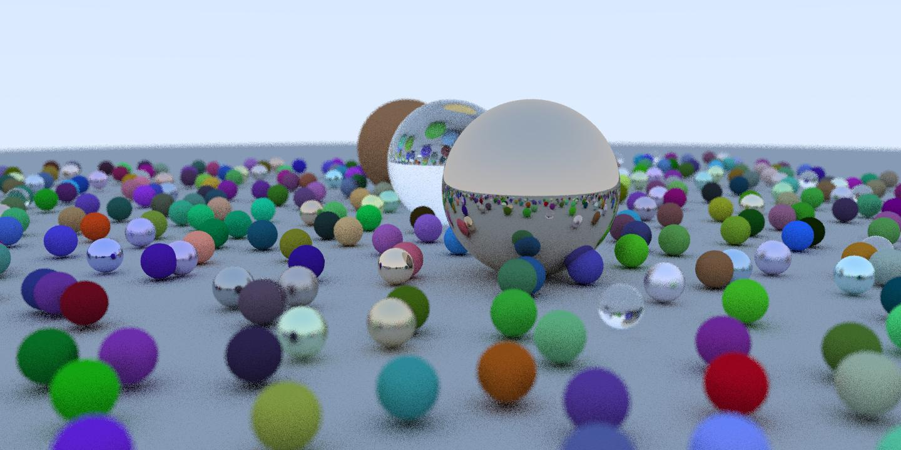

# Parallel Ray Tracing with MPI, OpenMP and CUDA

[](https://isocpp.org/)
[](https://developer.nvidia.com/cuda-toolkit)





## 📖 Overview

This project presents a comprehensive **performance analysis of ray tracing rendering** using different parallelization paradigms: **MPI**, **OpenMP**, and **CUDA**. Multiple parallelization strategies were **implemented and added** to the original codebase, then extensively benchmarked and compared, including hybrid approaches that combine different technologies.

> [!NOTE]  
> This project builds upon an existing C++ and CUDA ray tracing codebase. The original version included a sequential CPU implementation and a basic CUDA GPU renderer. The main contribution of this work is the implementation of new parallelization strategies for the CPU (using OpenMP, MPI, and hybrid MPI+OpenMP), along with a full performance analysis and benchmarking of all variants.

> 📄 **Full Analysis Report**: Complete performance analysis and detailed results are available in [`docs/report.pdf`](docs/report.pdf)

### 🎯 Key Features

- **Multiple Parallelization Strategies**: Rows, columns, blocks (chunks), and frames 
- **Technology Comparison**: OpenMP vs MPI vs CUDA vs Hybrid implementations 
- **Performance Analysis**: Detailed benchmarking and scalability studies
- **Hybrid Implementations**: MPI + OpenMP combinations 
- **Dynamic vs Static Load Balancing**: Multiple chunk distribution strategies 

## 🏗️ Project Structure

## 🏗️ Project Structure

```
Raytracing/
├── README.md
├── docs/
│   ├── render_example.png.jpg       # Sample render output
│   └── report.pdf                   # Complete performance analysis
└── PracticaRayTracing/
    ├── RaytracingCPU/               # CPU implementations
    │   ├── CMakeLists.txt
    │   ├── main_sequencial.cpp      # Sequential baseline
    │   ├── main_frames.cpp          # Multi-frame rendering
    │   ├── main_mpi_openmp.cpp     # Hybrid MPI + OpenMP
    │   ├── implementations/         # Core ray tracing engine
    │   │   ├── RayTracingImplementations.cpp
    │   │   ├── Scene.cpp           # Scene management
    │   │   ├── Camera.h            # Camera system
    │   │   ├── Material.h          # Material definitions
    │   │   └── ...
    │   ├── mpi/                    # MPI implementations
    │   │   ├── main_mpi_rows.cpp  # Row-based distribution
    │   │   ├── main_mpi_columns.cpp # Column-based distribution
    │   │   ├── main_mpi_chunk_dinamico_64.cpp # Dynamic chunks
    │   │   ├── main_mpi_chunk_estatico.cpp    # Static chunks
    │   │   └── main_mpi_frames.cpp # Multi-frame MPI
    │   ├── openmp/                 # OpenMP implementations
    │   │   ├── main_rows.cpp      # Row parallelization
    │   │   ├── main_columns.cpp   # Column parallelization
    │   │   ├── main_blocks.cpp    # Block parallelization
    │   │   ├── main_omp_chunk_dinamico.cpp # Dynamic scheduling
    │   │   └── main_frames_openmp.cpp      # Multi-frame OpenMP
    │   └── output/                 # Generated images
    └── RaytracingGPU/              # CUDA implementations
        ├── CMakeLists.txt
        ├── main_blocks.cu          # Block-based GPU rendering
        ├── main_rows.cu            # Row-based GPU rendering
        ├── main_columns.cu         # Column-based GPU rendering
        ├── main_multi.cu           # Multi-frame GPU rendering
        ├── raytracing.cu           # Core GPU ray tracing
        └── *.cuh                   # CUDA headers
```

## 🚀 Getting Started

### Prerequisites

- **C++17** compatible compiler (GCC 7+ recommended)
- **NVIDIA CUDA Toolkit** 11.0+ (for GPU implementations)
- **OpenMPI** (for MPI implementations)
- **OpenMP** support (usually included with modern compilers)
- **CMake** 3.12+

### 🔧 Installation & Compilation

1. **Clone the repository**
   ```bash
   git clone <repository-url>
   cd Raytracing
   ```

2. **Compile CPU implementations**
   ```bash
   cd PracticaRayTracing/RaytracingCPU
   cmake .
   make -j$(nproc)
   ```

3. **Compile GPU implementations**
   ```bash
   cd ../RaytracingGPU
   cmake .
   make -j$(nproc)
   ```


## Usage Examples

### OpenMP Implementations
```bash
# Set number of threads
export OMP_NUM_THREADS=6

# Row-based parallelization
./openmp/main_rows

# Column-based parallelization  
./openmp/main_columns

# Dynamic chunk scheduling
./openmp/main_omp_chunk_dinamico
```

### MPI Implementations
```bash
# Row distribution across processes
mpirun -np 6 ./mpi/main_mpi_rows

# Dynamic chunk distribution (recommended)
mpirun -np 6 ./mpi/main_mpi_chunk_dinamico_64

# Static chunk distribution
mpirun -np 6 ./mpi/main_mpi_chunk_estatico
```

### CUDA Implementations
```bash
cd PracticaRayTracing/RaytracingGPU

# Block-based parallelization (recommended)
./main_blocks

# Row-based parallelization
./main_rows

# Multi-frame rendering
./main_multi
```

### Hybrid MPI + OpenMP
```bash
# 3 processes × 2 threads each = 6 total workers
export OMP_NUM_THREADS=2
mpirun -np 3 ./main_mpi_openmp
```

## 📊 Performance Analysis

This project includes comprehensive performance benchmarking of different parallelization strategies that **were implemented and measured** as part of this work:


### Implemented Strategies

| Strategy          | OpenMP | MPI  | CUDA | Description                          |
|-------------------|--------|------|------|--------------------------------------|
| **Rows**          | ✅     | ✅   | ✅   | Distribute image rows across workers |
| **Columns**       | ✅     | ✅   | ✅   | Distribute image columns across workers |
| **Static Chunks** | ✅     | ✅   | ❌   | Fixed block distribution             |
| **Dynamic Chunks**| ✅     | ✅   | ❌   | Dynamic load balancing               |
| **Frames**        | ✅     | ✅   | ✅   | Multi-frame animation rendering      |
| **Hybrid**        | ✅     | ✅   | ❌   | MPI + OpenMP combination             |


### Ray Tracing Features
- **Materials**: Diffuse, metallic, and crystalline surfaces
- **Anti-aliasing**: Multiple samples per pixel (10-100 samples)
- **Complex scenes**: Randomly generated spheres with various materials
- **High-quality rendering**: Configurable resolution (640×480 to 1920×1080)

### Parallelization Approaches 
- **Fine-grained**: Dynamic work distribution for load balancing
- **Coarse-grained**: Static work distribution for minimal overhead
- **Memory access optimization**: Coalesced memory access in CUDA
- **Communication minimization**: Efficient data distribution in MPI


## ⚙️ Configuration

> [!NOTE]
> Default configurations correspond to the final benchmark parameters. Modify source code parameters for custom experiments.

### Common Parameters
- **Resolution**: 1200×800 (configurable)
- **Samples per pixel**: 50 (anti-aliasing quality)
- **Scene complexity**: Random scene with multiple spheres
- **Materials**: Mix of diffuse, metallic, and crystalline

### Hardware Requirements
- **CPU**: Multi-core processor (6+ cores recommended)
- **GPU**: NVIDIA GPU with Compute Capability 3.5+
- **Memory**: 4GB+ RAM
- **Storage**: ~100MB for output images

## 📈 Benchmarking

The project includes extensive performance analysis across:
- **Resolution scaling**: 640×480 to 1920×1080
- **Sample count**: 10 to 100 samples per pixel
- **Worker scaling**: 2 to 6 processes/threads
- **Block configurations**: Various CUDA block sizes (8×8, 16×16, 32×8)

**All measurements and analysis were conducted to compare the effectiveness of the newly implemented parallelization strategies.**

---

**Author**: Santiago Díaz


